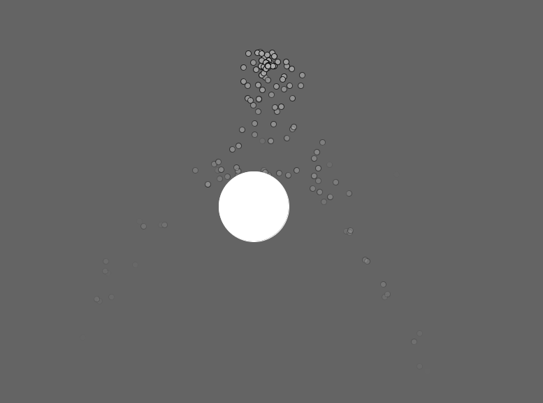

# NatureOfCode
The code I wrote and the sketches I made while reading "The Nature of Code" by Daniel Shiffman. As a visual learner with a background
in design and art I highly recommend the book as it manages to explain complex topics in a fun and engaging manner.
### General info
Nature of Code is a book about simulating natural processes using programming. It explores a variety of topics, such as physics,
calculus, autonomous agents and computer graphics. The book uses Processing, which is a library available for Java, Python and JavaScript (as p5.js).
Although the code is written in Processing, it is readily adaptable to other languages.  
The processing website is here -> https://processing.org/
### Organization
The files are organized by chapter, with a misc folder where I put the code I wrote myself or through following tutorials
on YouTube. To run the sketches you need the processing IDE which is available on the website above.
### Some Of The Cool Stuff In The Repository
Picture Dithering  
Gravity Simulation  
Particle Systems  
Random 3D Terrain Generation  
Autonomous Agents  
Genetic Algorithms  
3D cellular automata  
Fractal & LSystem visualization  
Neural Networks  
### Screenshots
Visualization of a 3D cellular automata (4/4/5/M ruleset).
 

Simple simulation of an ecosystem with a genetic algorithm at play.
 

Random 3D terrain generation based on perlin noise.
 

Genetic algorithm of rockets learning to go towards the target.
 

Genetic algorithm learning to randomly generate the target phrase (provided by the user).
 

Lorenz attractor visualization.
 

Visualization of a perceptron learning to predict which side of a line a particular point is.
 

Boids with the strength of rules being dictated by perlin noise.
 

Vehicles following a path.
 

LSystem fractal generation.
 

Pendulum swing.
 

Box2D demo.
 

Gravitational attraction.
 

Particle stream being repelled off of an object.
 

